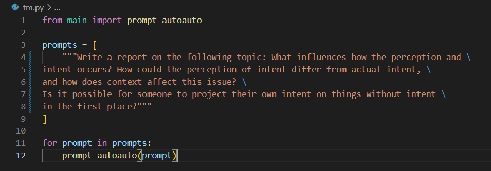
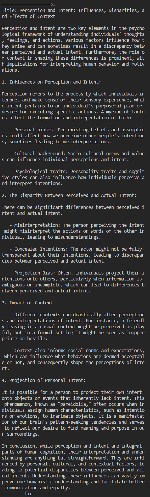

# AutoAuto Agent (AGI plc)

## What is AutoAuto?:  
AutoAuto is an LLM based Agent coded from scratch in Python. It's functionalities are similar to those of AgentGPT.

AutoAuto is built on GPT-4, and utilizes prompt chaining to increase accuracy in tasks such as navigating a 2-D or 3-D coordinate plane. It features various perks like being able to execute code, store things in it's context window, search things on the internet, visit urls, e.t.c.

## Prompting AutoAuto:
#### Requirements:
1. python 3.10+
2. pip
3. git bash
4. openai api key

Installing the python requirements:
```pip install requirements.txt```

Configuring the environment:
1. Create a file named '.env'
2. Copy the contents of the ```.env.sample``` file and replace the API key with your own. Paste this into the .env file.

#### Quickstart:
To see AutoAuto responding to a prewritten prompt:
```python tm.py``` (git bash)


#### Running a Prompt:
In main.py there is a function. Call the function with a prompt like:  
```
prompt = 'YOUR PROMPT HERE'
response = prompt_autoauto(prompt)
print(response)
```

#### Example:  

<p align="center">
  
</p>

<p align="center">
  
</p>

#### Note:
AutoAuto was built with task completion in mind. The prompt provided to AutoAuto becomes an 'objective', and AutoAuto does a recursive depth-first-search prompt chain with a maximum dfs limit for each chain reminding it that it has to complete the subtask within the given time frame to forward the primary objective. 


